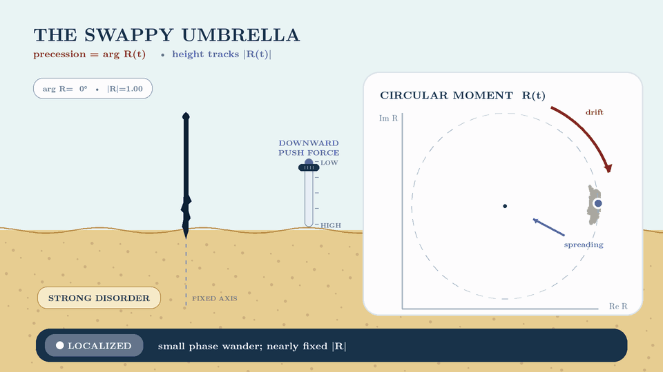
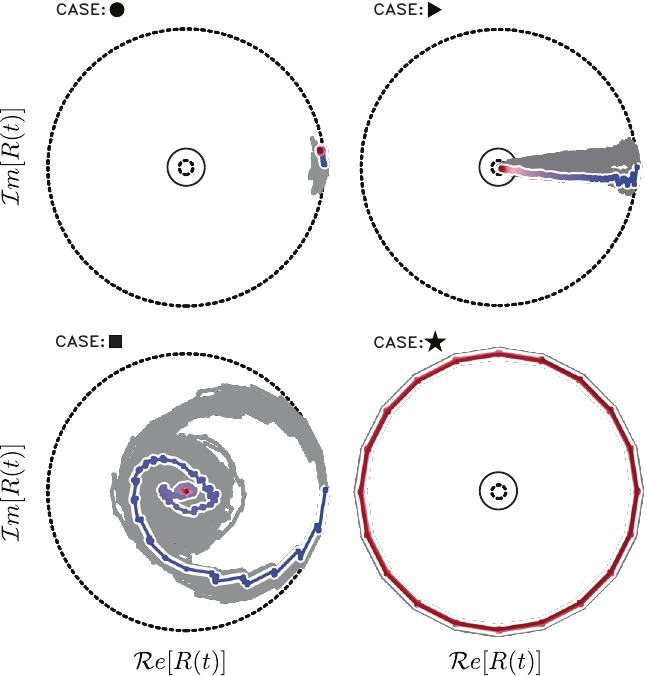

# 🌀 Anomalous Transport in U(1)-Symmetric Quantum Circuits

[](https://doi.org/10.1038/s41534-025-01178-8)
[](https://arxiv.org/abs/2411.14357)
[](https://www.python.org/)
[](docs/REPRODUCIBILITY.md)

Notebooks and reproduction code accompanying:

> Alessandro Summer, Alexander Nico-Katz, Shane Dooley, and John Goold,
> **“Anomalous transport in U(1)-symmetric quantum circuits,”**
> *npj Quantum Information* **12**, 32 (2026).
> [doi:10.1038/s41534-025-01178-8](https://doi.org/10.1038/s41534-025-01178-8)

**TL;DR.** We construct a strongly disordered, U(1)-symmetric Floquet
circuit from physically interpretable XXZ-like two-qubit gates. Its central feature is a genuinely discrete-time **swappy regime** near the generalized-SWAP line: an imperfect SWAP transfers most of a local
magnetization excitation to the neighboring qubit while leaving a small remnant behind. We study it by time evolting a one site excitation. The resulting packet moves fast, almost ballistically (close to the SWAP point) and at the same time locally diffuses quickly. The overall result is that it spreads faster than in the ordinary ergodic regime. This phenomenon has no direct continuous-time XXZ counterpart. To follow the packet across periodic boundaries, we introduce a complex **circular moment** whose phase measures directed motion and whose magnitude measures spreading using only local Z-basis expectation values.

**Keywords:** quantum transport · Floquet circuits · U(1) symmetry · disorder · statistics · localization · digital quantum simulation.

## 🏖️ The picture in one glance



Think of inserting a beach umbrella into highly disordered sand. To get it stuck into the sand pressing on the ground is not enough. For the pole to find a path through the disordered sand particles, it's more effective to add to the downward pressure a twirling around the umbrella vertical axis, a precession motion. However, if the angle of this precession is too big, twirling the umbrella becomes easier but the pole does not penetrate the beach.

In the animation this mapping loosely follows the qualitative geometry of the highlighted trajectories in the circular-moment plot below. The circuit dynamics are discrete: the right-hand plot displays the successive samples $R_n$. The umbrella dynamics are continuous: its angle and height interpolate between $\arg R_n$, $|R_n|$ and the next circuit sample. The localized path wanders only slightly near its initial point, the ergodic path contracts almost radially, the swappy path spirals clockwise while contracting, and near SWAP the path follows a 20-point orbit close to the unit circle. The common blue-to-red gradient encodes the circuit time index only; it does not encode regime, speed, spreading, or interaction strength.

The downward push is absent in the localized and near-SWAP cases, medium in the ergodic case, and slightly stronger in the swappy case. The maximum deepening is rescaled to one third of the umbrella's initial height; equivalently, the lowest canopy height remains two thirds of its initial value. The vertical projection is independent of phase, so rotation cannot introduce artificial up-and-down oscillations. The buried triangular tip is rigidly attached to the shaft and precesses with it. Strictly, inward contraction of $R$ measures spreading; that spreading is diffusive when $\sigma(t)\sim t^{1/2}$.

## 🎯 Main points

1. **🧭 A physically interpretable model is still a digital one.**

   Every U(1)-symmetric gate has an XXZ-type exchange interaction $J$, an Ising interaction $J_z$, and independent random phases. The disorder stays order-one in the process of varying $J$ and $J_z$, thus small values of couplings do not quietly make the model a weak Trotter step for the continuous time. The same model can therefore be used to study the phenomena of localized-like, ergodic, swappy, and generalized-SWAP transport.
   [Walkthrough](notebooks/01_from_gate_to_swappy.ipynb)

2. **🎯 Periodic evolution needs circular statistics.**

   On a ring, the sites $N-1$ and $0$ are neighboring each other. However, an ordinary linear mean or variance would misinterpret a narrow packet that crosses this junction as being distributed on the entire lattice. Transformation of the magnetization distribution to quasi-probability $p_n(t)$ and further to $R(t)=\sum_n p_n(t)\exp 2\pi i n/N$ makes it possible to eliminate the effect of the boundary: the phase angle of $R$ follows drift on the ring, while contraction of $|R|$ follows spreading. The diagnosis requires only local Z-basis measurements.
   [Analysis walkthrough](notebooks/02_circular_moment_and_reproduction.ipynb)

3. **🌀 The key observation is super-ergodic diffusion.**

   Close to the generalized-SWAP line, each gate transfers most of the magnetization to the adjacent spin but retains a small portion. Thus, a coherent peak propagates ballistically, gradually leaving some of the excitation behind leading to a diffusion that is globally faster than ergodic one even in the presence of disorder. Entanglement and level statistics do not provide any information about the transient **swappy regime**: the moving coherent peak is present only in the dynamical properties.
   [Dynamical reproduction](notebooks/01_from_gate_to_swappy.ipynb)

4. **⏳ Swappy transport is prethermal and purely discrete-time.**

   The phenomenon utilizes the finite duration of near-$\pi$ exchange pulse: the almost-SWAP gate is responsible for the transport and split of local magnetization.
   It vanishes in the usual continuous-time limit and does not have any analog in the disordered continuous-time XXZ chain. Thermalization time increases proportionally to $t_{\mathrm{th}}\sim(\pi-J)^{-2}$ when approaching SWAP point.
   [Reproducibility map](docs/REPRODUCIBILITY.md)

5. **🔬 Generalized SWAPs defeat disorder but are sensitive to detuning.**

   At the generalized-SWAP line, random phases do not stop ballistic transfer: the excitation keeps circulating without thermalizing. A small detuning from perfect SWAP makes every hand-off slightly incomplete, so remnants accumulate and ultimately destroy the coherent peak. The investigated swappy window is therefore long-lived and robust over finite parameter and system-size ranges, but not an asymptotically stable phase.

## 🌀 How to read the circular moment



*Clockwise from the upper left: localized (●), ergodic (▶), near-SWAP (★), and swappy (■).*

Rotation of $R(t)$ tracks coherent drift of the excitation, while contraction
toward the centre tracks its spreading. The ergodic trajectory therefore moves
almost radially inward, the swappy trajectory spirals inward, and the near-SWAP
trajectory remains close to the outer rim.

## 📓 The notebooks

1. [`01_from_gate_to_swappy.ipynb`](notebooks/01_from_gate_to_swappy.ipynb)
   Construct the U(1)-symmetric gate and watch the four regimes emerge.

2. [`02_circular_moment_and_reproduction.ipynb`](notebooks/02_circular_moment_and_reproduction.ipynb)
   Build the circular moment and reproduce the transport analysis.

Execute both:

```bash
make setup
make notebooks
```

## ▶️ Reproduce the results

For a laptop-scale reproduction:

```bash
make setup
make quick
```

This generates:

| Paper result | Output |
|---|---|
| Static localization and ergodicity diagnostics | `static_diagnostics.png` |
| Four dynamical regimes | `magnetization_regimes.png` |
| Circular-moment trajectories | `circular_moment.png` |
| Spread, drift, peak decay, and coupling scan | `transport_observables.png`, `phase_scan.png` |

The figures are written to `artifacts/quick/`. Verify the implementation with:

```bash
make test
```

For the published main dynamical settings:

```bash
make paper
```

The paper profile uses `N=20`, 100 disorder realizations, 10,000 Floquet cycles, and 33 values of $J$. It is an HPC-scale, resumable calculation.
See [`docs/REPRODUCIBILITY.md`](docs/REPRODUCIBILITY.md) for the exact figure map, conventions, and computational scope.

## 📁 Repository contents

```text
notebooks/   guided explanation
src/swappy/  supported simulation and analysis
tests/       physics and reproducibility checks
docs/        detailed methods and figure map
data/        two archived static-data tables
```
